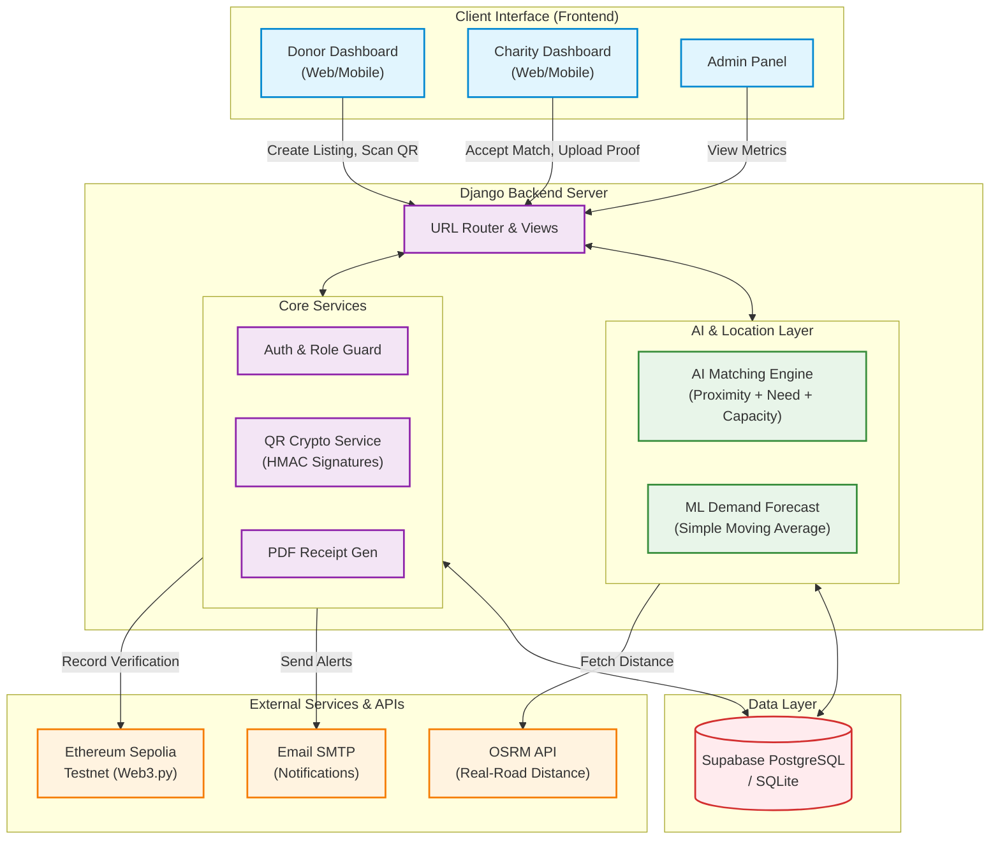
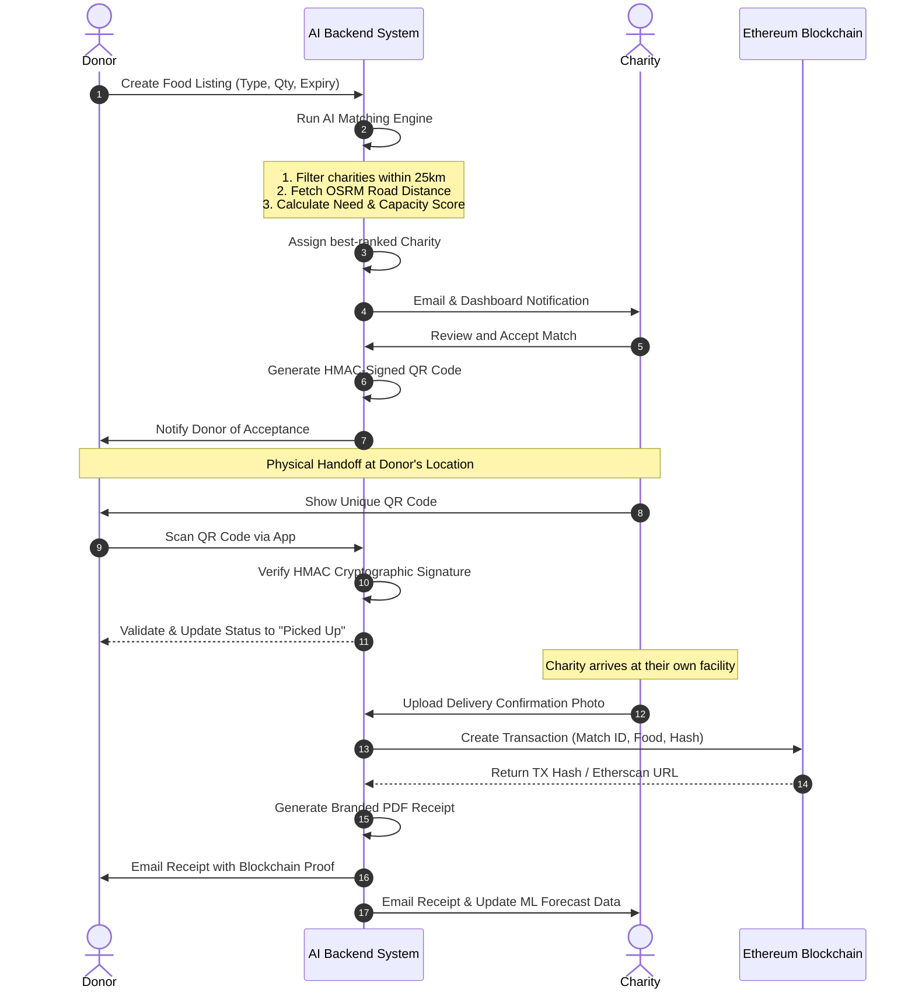

# FoodWasteChain - Project Diagrams

This document contains two visual diagrams that explain the entire project's architecture and the step-by-step workflow. You can view these diagrams using any Markdown viewer that supports Mermaid (like GitHub, VS Code, or online at [mermaid.live](https://mermaid.live)).

## 1. System Architecture Diagram
This diagram shows the main components of the FoodWasteChain platform and how they interact with each other.

---

## 2. System Sequence Flow Diagram
This diagram illustrates the chronological step-by-step interaction between the Donor, the System, the Charity, and the Blockchain during a food donation lifecycle.

